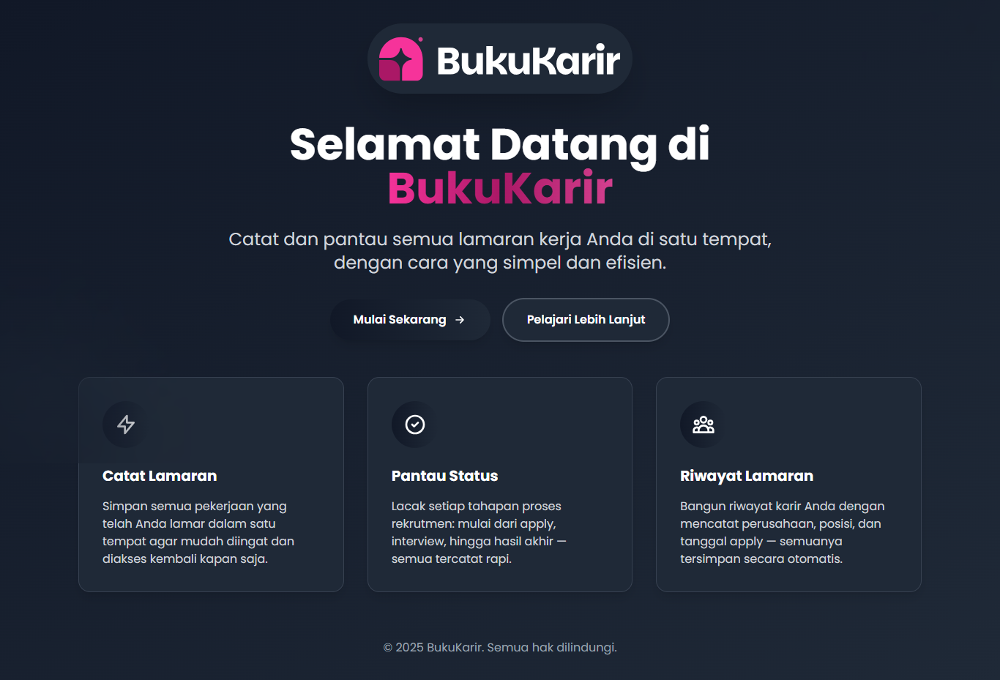

# 📋 BukuKarir

**Catat dan pantau semua lamaran kerja Anda di satu tempat, dengan cara yang simpel dan efisien.**

BukuKarir adalah aplikasi web yang membantu Anda mengelola dan melacak semua aplikasi lamaran kerja dengan mudah. Dibangun menggunakan Laravel dan Filament untuk pengalaman pengguna yang modern dan intuitif.



## ✨ Fitur Utama

- 📝 **Pencatatan Lamaran**: Catat semua lamaran kerja dengan detail lengkap
- 📊 **Dashboard Analytics**: Lihat statistik lamaran Anda dalam bentuk grafik
- 🔄 **Tracking Status**: Pantau perkembangan setiap lamaran dari applied hingga diterima/ditolak
- 📱 **Responsive Design**: Akses dari desktop, tablet, atau mobile
- 👤 **Multi-User**: Setiap pengguna memiliki data terpisah dan aman
- 📈 **Riwayat Perubahan**: Lacak semua perubahan yang terjadi pada data lamaran
- 🔍 **Filter & Search**: Cari dan filter lamaran berdasarkan berbagai kriteria
- 📅 **Timeline View**: Lihat lamaran berdasarkan tanggal aplikasi
- 🏢 **Platform Tracking**: Catat platform mana yang digunakan untuk melamar

## 🚀 Demo

[Live Demo](https://bukukarir.speechlessmind.com) | [Screenshots](public/docs)

## 🛠️ Teknologi yang Digunakan

- **Backend**: Laravel 12.x
- **Frontend**: Filament Admin Panel 3.x
- **Database**: MySQL/PostgreSQL
- **Authentication**: Laravel Breeze/Sanctum
- **Styling**: Tailwind CSS
- **Icons**: Heroicons

## 📋 Persyaratan Sistem

- PHP >= 8.2
- Composer
- Node.js >= 16.x
- NPM atau Yarn
- MySQL >= 8.0 atau PostgreSQL >= 13
- Web Server (Apache/Nginx)

## 🚀 Instalasi

### 1. Clone Repository

```bash
git clone https://github.com/username/bukukarir.git
cd bukukarir
```

### 2. Install Dependencies

```bash
# Install PHP dependencies
composer install

# Install JavaScript dependencies
npm install
```

### 3. Environment Setup

```bash
# Copy environment file
cp .env.example .env

# Generate application key
php artisan key:generate
```

### 4. Database Configuration

Edit file `.env` dan sesuaikan konfigurasi database:

```env
DB_CONNECTION=mysql
DB_HOST=127.0.0.1
DB_PORT=3306
DB_DATABASE=bukukarir
DB_USERNAME=your_username
DB_PASSWORD=your_password
```

### 5. Database Migration & Seeding

```bash
# Jalankan migration
php artisan migrate

# (Opsional) Jalankan seeder untuk data dummy
php artisan db:seed
```

### 6. Build Assets

```bash
# Development
npm run dev

# Production
npm run build
```

### 7. Create Admin User

```bash
php artisan make:filament-user
```

Ikuti instruksi untuk membuat user admin pertama.

### 8. Start Development Server

```bash
php artisan serve
```

Aplikasi akan berjalan di `http://localhost:8000`


## 📖 Penggunaan

### 1. Login ke Dashboard Panel

Akses aplikasi di browser dan login menggunakan kredensial admin yang telah dibuat.

### 2. Menambah Lamaran Baru

1. Klik menu **"Lamaran Kerja"**
2. Klik tombol **"Tambah Baru"**
3. Isi form dengan informasi lamaran:
   - Nama Perusahaan
   - Posisi yang dilamar
   - Tanggal melamar
   - Status (Applied, Interview, Test, Diterima, Ditolak)
   - Platform (LinkedIn, JobStreet, Glints, dll)
   - Catatan tambahan
4. Klik **"Simpan"**

### 3. Melacak Status Lamaran

- Status lamaran akan otomatis ter-update dengan kode warna
- Setiap perubahan status akan tercatat di **"Riwayat Perubahan"**
- Gunakan filter untuk melihat lamaran berdasarkan status tertentu

### 4. Melihat Analytics

Dashboard akan menampilkan:
- Total lamaran yang dikirim
- Distribusi status lamaran
- Tren lamaran per bulan
- Platform paling efektif

## 🔧 Konfigurasi

### Status Lamaran

Status default dapat dimodifikasi di `app/Models/Task.php`:

```php
public static function getStatusOptions()
{
    return [
        'Applied' => 'Applied',
        'Interview' => 'Interview',
        'Test' => 'Test',
        'Diterima' => 'Diterima',
        'Ditolak' => 'Ditolak',
    ];
}
```

### Warna Status

Kustomisasi warna status di `app/Models/Task.php`:

```php
public function getStatusColorAttribute()
{
    $colors = [
        'Applied' => 'primary',
        'Interview' => 'warning',
        'Test' => 'info',
        'Diterima' => 'success',
        'Ditolak' => 'danger',
    ];

    return $colors[$this->status] ?? 'secondary';
}
```

## 📁 Struktur Project

```
bukukarir/
├── app/
│   ├── Filament/
│   │   └── Resources/
│   │       ├── TaskResource.php
│   │       └── HistoryResource.php
│   ├── Models/
│   │   ├── Task.php
│   │   ├── History.php
│   │   └── User.php
│   └── Http/Controllers/
├── database/
│   ├── migrations/
│   └── seeders/
├── resources/
│   └── views/
└── routes/
```

## 🤝 Contributing

Kami menyambut kontribusi dari komunitas! Silakan ikuti langkah berikut:

1. Fork repository ini
2. Buat branch fitur baru (`git checkout -b feature/AmazingFeature`)
3. Commit perubahan Anda (`git commit -m 'Add some AmazingFeature'`)
4. Push ke branch (`git push origin feature/AmazingFeature`)
5. Buat Pull Request

## 📄 License

Project ini dilisensikan under MIT License - lihat file [LICENSE](LICENSE) untuk detail.


## 🙏 Acknowledgments

- [Laravel](https://laravel.com) - Framework PHP yang luar biasa
- [Filament](https://filamentphp.com) - Admin panel yang powerful
- [Tailwind CSS](https://tailwindcss.com) - Utility-first CSS framework
- [Heroicons](https://heroicons.com) - Beautiful hand-crafted SVG icons


---

<div align="center">

**Dibuat dengan ❤️**

[⭐ Star Repository](https://github.com/sfauzi/book-career) | [🐛 Report Bug](https://github.com/sfauzi/book-career/issues) | [💡 Request Feature](https://github.com/sfauzi/book-career/issues)

</div>
